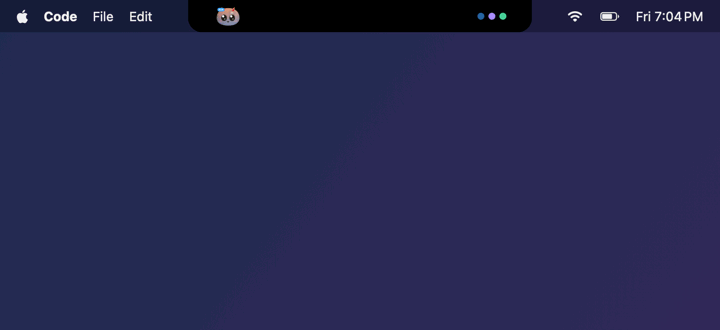
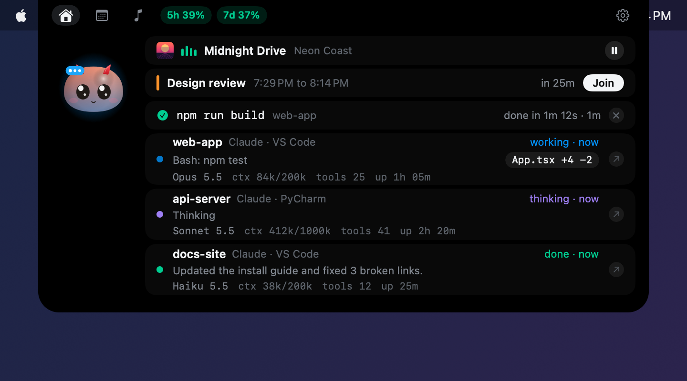
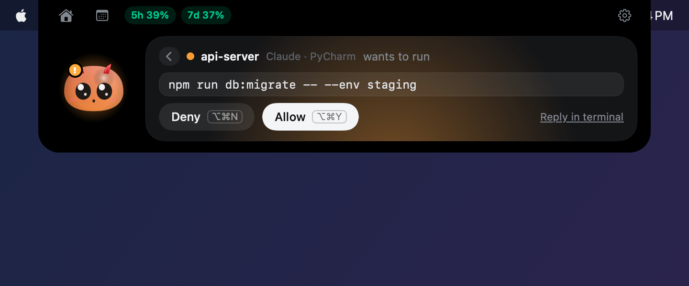
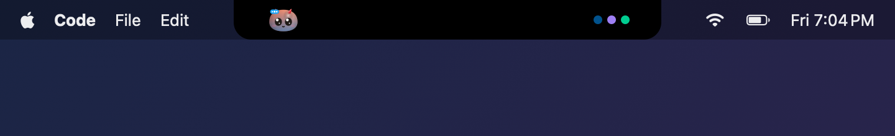
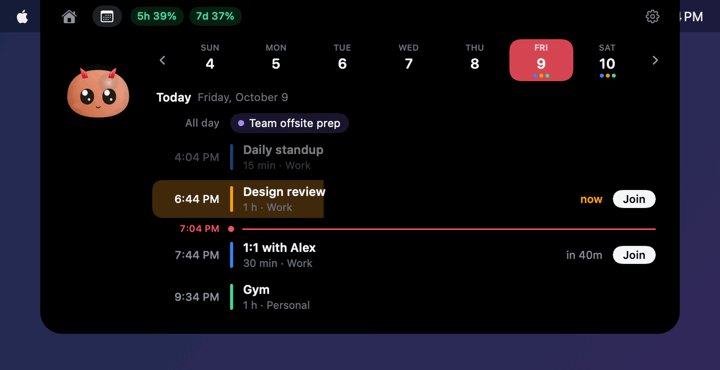
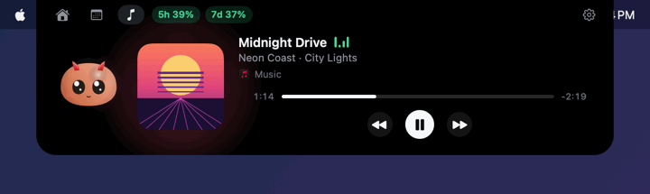
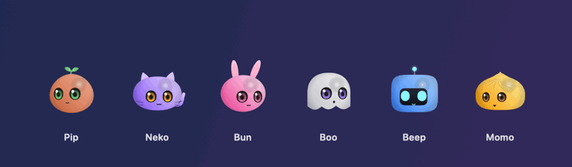
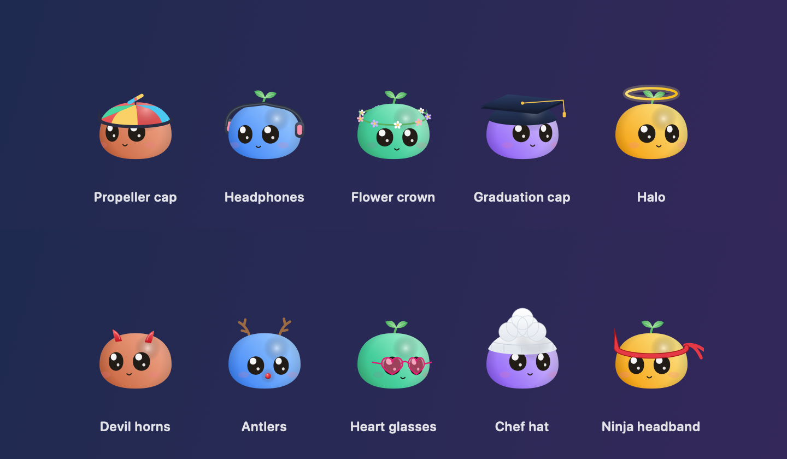

<p align="center">
  
</p>

<h1 align="center">m_notch</h1>

<p align="center">
  Turns your MacBook's notch into a little island for your <b>Claude Code</b> sessions.<br>
  See what every session is doing, answer its questions, and glance at your calendar and music,<br>
  without leaving the code you are writing.
</p>

<p align="center">
  <a href="https://github.com/thanmay-strativ/m-notch-app/releases/latest/download/m_notch.zip"><b>⬇ Download m_notch.zip</b></a>
  &nbsp;·&nbsp; <a href="#install">Install</a>
  &nbsp;·&nbsp; <a href="#first-use">First use</a>
  &nbsp;·&nbsp; <a href="#features">Features</a>
  &nbsp;·&nbsp; <a href="#updates">Updates</a>
  &nbsp;·&nbsp; <a href="#credits">Credits</a>
</p>

---

## What it does

You run Claude Code in a PyCharm or VS Code terminal. Normally, when Claude needs you ("Can I run `npm test`?"), you have to notice it, find the right window and type an answer.

With m_notch, the notch grows into an island that shows the question right away. You click **Allow** (or press **⌥⌘Y**) and go back to what you were doing.

- 👀 **See every session:** which project, what it is doing, how much context it has used.
- ✅ **Answer from the notch:** permissions, questions and plans, with Touch ID for risky commands.
- 📅 **Calendar:** today's meetings with a Join button.
- 🎵 **Now playing:** Music, Spotify or YouTube in Chrome, with play, pause and seek.
- ⏱ **Terminal commands:** a check or a cross when a long command (tests, builds) finishes.
- 🐾 **A small buddy:** six characters that react to what Claude is doing.

## Install

> You need a Mac with Apple silicon (M1 or newer) and macOS 15 Sequoia or newer. A notch is nice but not required: without one, the island sits as a small bar at the top center of the screen.

1. **Download** [m_notch.zip](https://github.com/thanmay-strativ/m-notch-app/releases/latest/download/m_notch.zip) and double-click it to unzip.
2. **Drag** `m_notch.app` into your **Applications** folder. (This matters: updates can only replace the app from there.)
3. **Open it.** The first time, macOS says it "cannot verify" the app. That is because m_notch is not signed with a paid Apple developer certificate. To open it anyway:
   - Click **Done**, open **System Settings → Privacy & Security**, scroll down and click **Open Anyway** next to m_notch.
   - Or run this once in Terminal, then open the app normally:
     ```sh
     xattr -dr com.apple.quarantine /Applications/m_notch.app
     ```
4. A small notch icon appears in your **menu bar** (m_notch has no Dock icon).

## First use

1. Click the menu bar icon, then **Install Claude hooks…**. m_notch shows you the full new `~/.claude/settings.json` before writing anything, makes a dated backup, and keeps your own settings and hooks.
2. Start Claude Code in a PyCharm or VS Code terminal (the VS Code Claude panel works too). The island peeks out as soon as the session starts working.
3. Optional: **Settings → Agents → Status line relay: Install…** adds the model, context use and your 5-hour and 7-day plan usage to the island. Your own status line keeps printing the same thing.
4. Optional: **Settings → Extras** turns on the calendar, now playing and the terminal hook.

**Example:** Claude wants to run `rm -rf build`. The island opens with a red card that says "risky: rm -rf". You click **Allow**, confirm with Touch ID, and Claude carries on.

> If m_notch is not running, Claude is never blocked: the hook fails quietly and Claude asks in the terminal as usual.

## Features

### Every session at a glance

Hover the notch to peek, click to open. Each row shows the project, what Claude is doing right now, and a stats line (model, context used, tool calls, uptime). Click a row to jump to that project's window in PyCharm or VS Code.

<p align="center"></p>

### Answer without switching windows

Permission requests, Claude's multiple-choice questions and plans (Approve plan, Keep planning) show as cards. Risky commands (`rm -rf`, `sudo`, `git push --force`, writes to `.env` or outside the project) turn the card red and ask for Touch ID.

<p align="center"></p>

Changed a file? Click its chip (`views.py +12 -3`) to see the diff, then **Open at line** to jump there in your IDE.

### Small while you work

When you move the pointer away, the island shrinks to a small bar: your buddy on the left, one dot per session on the right (orange means it needs you). After a few quiet seconds it hides completely.

<p align="center"></p>

### Calendar

A calendar tab next to the house icon shows your week. Tap a day to see its meetings, with a red "now" line, a countdown to the next one and a **Join** button for Zoom, Google Meet, Teams and Webex links. It reads the macOS Calendar app, so add your Google or Outlook account there. Turn it on in **Settings → Extras**.

<p align="center"></p>

### Now playing

Whatever shows in Control Center's "Now Playing" (Music, Spotify, a YouTube video in Chrome, a podcast) appears in a music tab with the artwork, a progress bar you can drag to seek, and previous, play/pause and next. On by default.

<p align="center"></p>

### Terminal commands

Install the zsh hook in **Settings → Extras**. When a command that ran 30 seconds or more ends, the island shows it, for example `pytest -x  web-app  failed (exit 1) after 2m 10s`. Editors, ssh, REPLs and commands you stop with Ctrl-C are skipped.

### Pick your buddy

Six characters of our own: Pip, Neko, Bun, Boo, Beep and Momo. Each one looks at your pointer, thinks while Claude works, bounces when it needs you and celebrates when it is done. Click it for a random trick (three quick clicks make it dizzy). Choose one, its color and an outfit in **Settings → Appearance**.

<p align="center"></p>

<details>
<summary><b>See all 10 outfits</b></summary>
<br>
<p align="center"></p>

Pick **Auto** and the outfit follows the season: devil horns in October, antlers in December, a flower crown at Easter.
</details>

## Keyboard shortcuts

| Keys | What it does |
|---|---|
| ⌥⌘Y | Allow (or Approve plan) |
| ⌥⌘N | Deny (or Keep planning) |
| ⌥⌘A | Always allow |
| ⌥⌘1 to ⌥⌘4 | Pick a question option |
| ⌥⌘M | Open or close the island, any time |

The answer shortcuts only work while a request is waiting, so they never clash with your IDE.

## Updates

m_notch checks GitHub for a new version once a day. When one is out, it asks **Install and Relaunch?**: it downloads the new version, checks its SHA-256 fingerprint, replaces itself and opens again. You can also click **Check for Updates…** in the menu bar, or turn the daily check off in **Settings → About**.

> After an update, macOS may ask again for Accessibility (used to raise the exact project window) and Calendars. That is because the app is signed on this Mac, not with a paid Apple certificate, so every version looks new to macOS. Just allow it again.

## Privacy

Everything stays on your Mac. The hook server only listens on `127.0.0.1` and needs a secret token, now playing is read locally, and the calendar is read from the Calendar app. The only thing m_notch sends out is the daily update check to GitHub.

<details>
<summary><b>Build from source</b></summary>
<br>

You need macOS 15 or newer and the Xcode Command Line Tools (`xcode-select --install`). Full Xcode is not required.

```sh
git clone https://github.com/thanmay-strativ/m-notch-app.git
cd m-notch-app
scripts/dev.sh test   # run the unit tests
scripts/dev.sh app    # build build/m_notch.app, sign it for this Mac and open it
```

To publish a new version (needs the [GitHub CLI](https://cli.github.com) and a clean working tree):

```sh
scripts/release.sh 0.2.0 "What changed, in one line"
```

It sets `VERSION`, commits and tags it, builds the app, and uploads `m_notch.zip` with its `.sha256` file to a GitHub release. Installed copies pick it up within a day.

The design notes, with how each part works, are in [`docs/specs/2026-10-09-m-notch-design.md`](docs/specs/2026-10-09-m-notch-design.md).
</details>

<details>
<summary><b>Manual checks before a release</b></summary>
<br>

These need a real Mac and cannot run as unit tests:

- [ ] Hover the notch to peek, click to open, move away to close.
- [ ] Buttons work on the first click (Allow, Deny, a session row, a diff chip).
- [ ] A real permission prompt in the PyCharm terminal: Allow, Deny and Always from the notch. Answering in the terminal instead closes the card.
- [ ] A Claude question, including a multi-select one: the answer reaches Claude.
- [ ] Plan mode: the plan shows, and Approve plan and Keep planning work.
- [ ] A session in the VS Code Claude panel shows up, and ↗ jumps to VS Code.
- [ ] A diff chip, then "Open at line", opens the file at that line in PyCharm and VS Code.
- [ ] Calendar: real events show with their colors, days and weeks slide smoothly, Join opens the call.
- [ ] Now playing: a YouTube video in Chrome shows up, and pause, next, previous and seeking work.
- [ ] Terminal hook: `sleep 31; false` in a new terminal tab shows a red cross with "failed (exit 1) after 31s".
- [ ] Update: with an older version installed, **Check for Updates…** offers the new one and relaunches into it.
</details>

## Credits

m_notch stands on the shoulders of these open source projects. Thank you!

- **[coucou](https://github.com/Louis-CFM/coucou)** by Louis Raillé: the notch island, its animations and the character engine are ported from coucou, under the MIT License (see [`LICENSES/coucou-MIT.txt`](LICENSES/coucou-MIT.txt)). coucou's own Mochi character, names, icon and sounds are not used: m_notch's characters are its own designs.
- **[mediaremote-adapter](https://github.com/ungive/mediaremote-adapter)** by ungive: the idea of reading "Now Playing" through the system's `/usr/bin/perl`, which still works since macOS 15.4 locked it down.
- **[boring.notch](https://github.com/TheBoredTeam/boring.notch)**: inspiration for putting music and a calendar in the notch.
